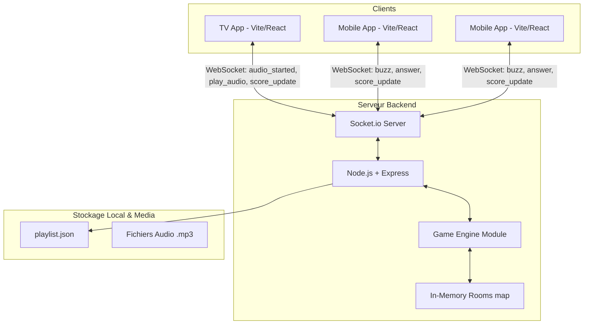

# Architecture de BlindTest Live

BlindTest Live est un système temps-réel multijoueur conçu avec une architecture *Monorepo* (NPM Workspaces). Il s'appuie sur une communication WebSockets constante entre un écran de diffusion "TV" et des téléphones "Mobiles" agissant comme contrôleurs.

## Vue d'Ensemble des Composants

## Structure du Monorepo

*   **`shared/`** : Librairie NPM interne (`package.json`) hébergeant les types TypeScript partagés (`Track`, `Player`, `Room`) ainsi que l'énumération des événements Socket.io (`SocketEvents.ts`). Ce dossier garantit une stricte correspondance des types entre le serveur et les clients.
*   **`server/`** : Serveur exécutif Node.js orchestrant le jeu. 
    *   **Contraintes Réseau/Latence** : Gère l'attribution initiale des points et le blocage des buzz sur une chronologie (Timestamps). C'est pourquoi les informations du statut du salon et des joueurs sont stockées en *RAM / In-Memory (Map<string, Room>)* de façon volontaire, afin de répondre dans la milliseconde aux actions (latence ciblée < 50ms).
    *   **Assets** : Expose la musique et charge la disposition du jeu via `assets/playlist.json`.
*   **`tv-app/`** : L'Écran Diffuseur (React).
    *   S'occupe de jouer les pistes via Web Audio API en arrière plan, puis d'envoyer le top départ (événement `AUDIO_STARTED`) au serveur. 
    *   Affiche les scores en utilisant `framer-motion` avec un style néon "Cartoon Déjanté".
*   **`mobile-app/`** : Le Contrôleur (React).
    *   Ne joue **AUCUN SON**, mais affiche le buzzer et les questions du QCM.
    *   Génère les identifiants en localStorage pour empêcher deux appareils identiques de voter pour un même compte. Un appareil = Un identifiant persistant dans le navigateur.

## Diagramme Séquentiel d'une Partie

### Phase 1 : Attente et Musique
Le serveur reçoit du modérateur/TV qu'on lance la piste 1.
1. `SERVER -> TV` : Émet `PLAY_AUDIO`.
2. L'Écran TV charge et joue l'audio.
3. `TV -> SERVER` : Émet la confirmation `AUDIO_STARTED` accompagnée du timestamp T0.
4. Le Serveur retransmet immédiatement le début de partie aux mobiles et lance le chronomètre central de la Room.

### Phase 2 : Le Buzz & Les Points
5. Un joueur tape sur le buzzer sur l'App Mobile.
6. `MOBILE -> SERVER` : Émet le `BUZZ` avec son identifiant et son Timestamp propre.
7. Dès le 1er buzz validé (ou au plus rapide), le serveur passe la room en statut "BUZZED".
8. `SERVER -> TV / SERVER -> MOBILE` : Émet l'événement `BUZZ_LOCKED` à tout le monde. L'Audio de la TV S'ARRETE alors.
9. Optionnel: les questions QCM s'affichent sur les Mobiles. 
10. `MOBILE -> SERVER` : Le Mobile soumet sa réponse au serveur. Le serveur la compare et calcule les points du compte `{ 1000 - msécoulées/10 }`, et met à jour l'objet Room.
11. L'événement `SCORE_UPDATE` est diffusé. La TV se met à animer les barres de classement vers le haut.

## Événements Socket.io (`shared/events.ts`)

| Event  | Émetteur | Récepteur | Description |
|--------|----------|-----------|-------------|
| `join_room` | Mobile, TV | Serveur | Une device tente de rejoindre une Room ID |
| `room_joined` | Serveur | Mobile, TV | Accusé de réception confirmant l'entrée et l'état actuel  |
| `play_audio` | Serveur | TV | Ordre de lire la musique N  |
| `audio_started` | TV | Serveur | Confirme la lecture au Timestamp exact |
| `buzz` | Mobile | Serveur | Action de Buzzer ! |
| `buzz_locked` | Serveur | TV, Mobile | Coupe le son TV, grise les buzzers Mobile |
| `answer` | Mobile | Serveur | Réponse au QCM envoyée au calcul |
| `score_update`| Serveur | TV, Mobile | Le classement change |

Cette documentation servira de référence tout au long des itérations pour inclure des bases de données locales (ex: SQLite) si le stockage temporaire doit persister à d'éventuels re-démarrages.
